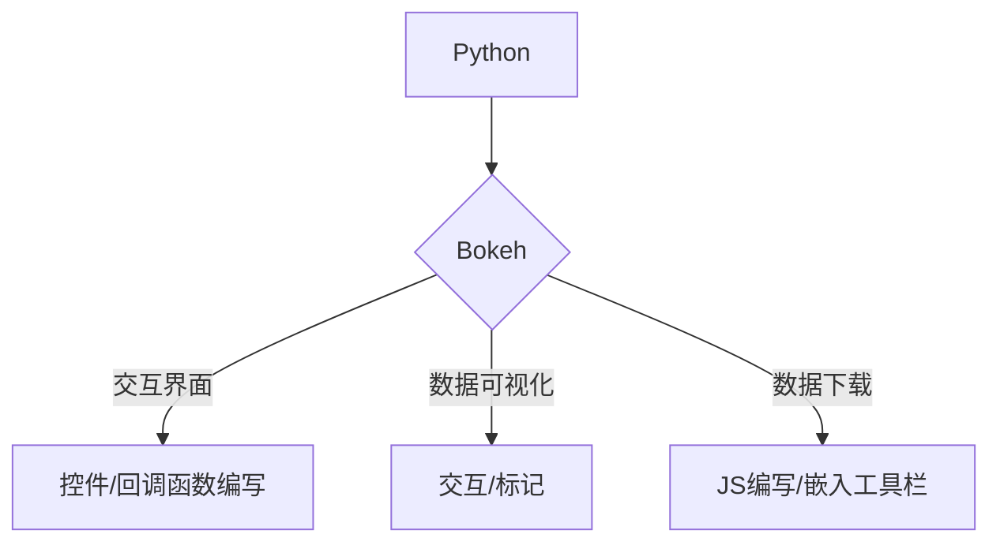

### 数据标记工具开发

*目前针对时序数据或信号数据*

* * *

在实际的机器学习或深度学习中，会遇到数据集的提取工作，数据集的质量会对模型的能力产生直接的影响

但是数据标注工作较为繁琐，效率较低，针对这一问题，开发数据标记工具，简化标记过程，提高工作效率。

#### 1、四大模块

1. 文件读取：读取预处理后的数据
2. 数据可视化：
   ①全量数据可视化（数据超过百万条 响应速度会变慢）
   ②分批次可视化（按需求分多个批次 下图中一个批次有十万条数据）
3. 标注：矩形标记，提取索引（时间戳），提取样本长度（时间）。标记信息可    在下方表中同步显示出。
4. 下载：将标记后的label数据下载后来，默认保存为csv格式，后续只需写个遍    历的小程序将特征样本提取出来即可。

#### 2、开发工具-VSC

##### Python + Bokeh + JavaScript.

